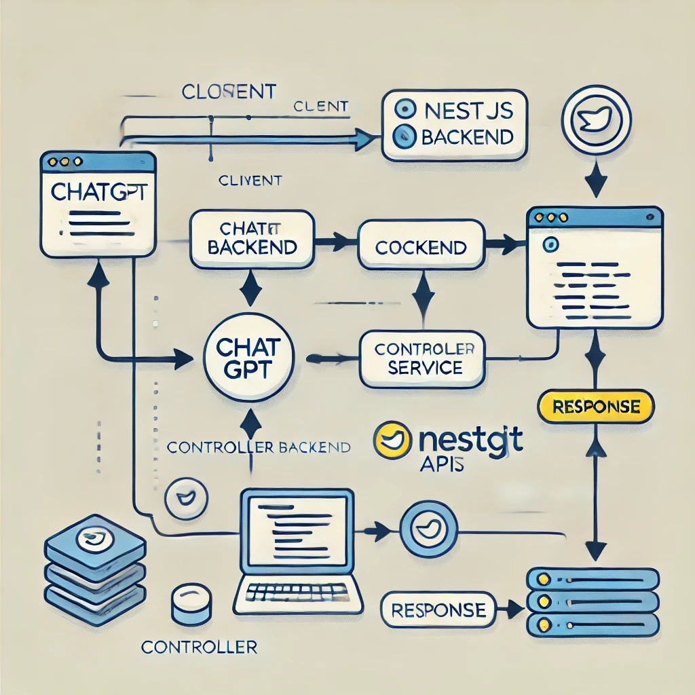

# ChatGPT Integration with NestJS 🚀\



This repository demonstrates how to integrate **ChatGPT API** into a **NestJS** application. The project showcases the basic communication flow between the API and a NestJS backend to send prompts and receive AI-generated responses.

---

## Features
- NestJS-based backend  
- ChatGPT API integration  
- Asynchronous prompt handling

---

## Prerequisites
Make sure you have the following installed:
- **Node.js** (v16+)  
- **NestJS CLI**  
- OpenAI API Key (get yours from [https://platform.openai.com](https://platform.openai.com))

---

## Installation & Setup
1. Clone the repository:
   ```bash
   git clone <your-repo-url>
   cd nestjs-chatgpt-integration

2. Install dependencies:
   ```bash
   npm install

3. Add your OpenAI API key in the .env file:
   ````bash
   OPENAI_API_KEY=your_openai_api_key
   
4. Start the NestJS server:
   ````bash
   npm run start:dev
